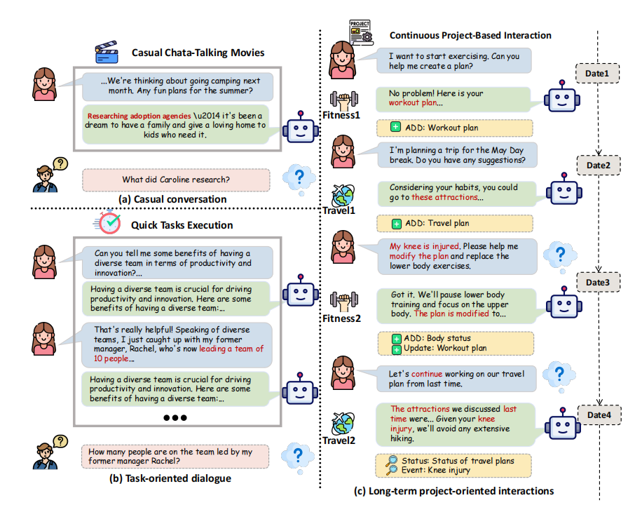
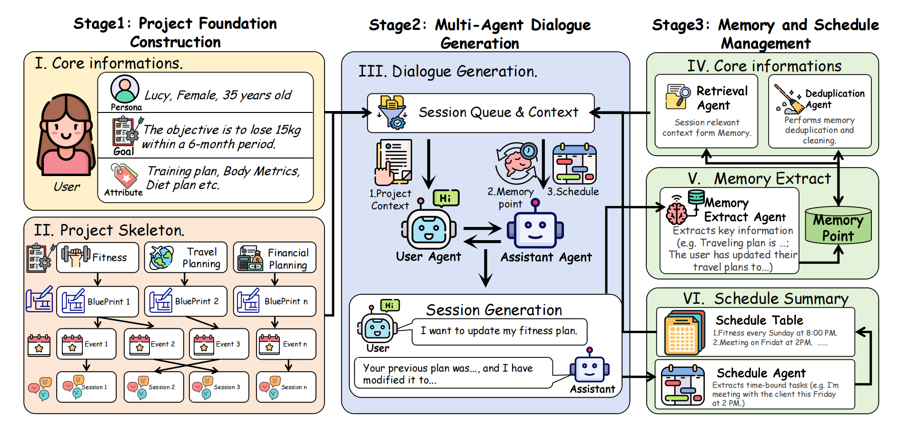
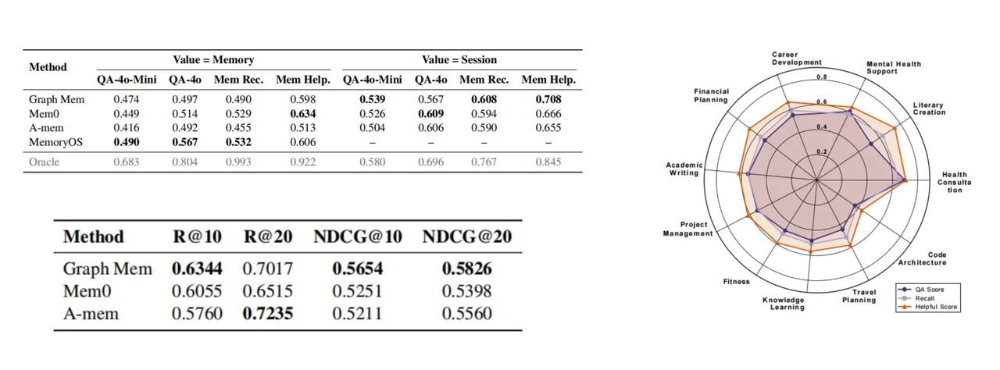

<div align="center">
  
  <h1 align="center" style="color: #2196F3; font-size: 24px; font-weight: 600; margin: 20px 0; line-height: 1.4;">
    🧠 RealMem: <span style="color: #555; font-weight: 400; font-size: 18px;"><em>Benchmarking LLMs in Real-World Memory-Driven Interaction</em></span>
  </h1>
  
  <p style="margin: 20px 0;">
    <a href="#"></a>
    <a href="LICENSE"></a>
    <a href="https://quantaalpha.github.io/"></a>
  </p>
</div>

## 📰 News

- **2026.01.11** 🎉 We open-sourced **RealMem** — a robust multi-agent framework designed to simulate realistic user-assistant interactions with sophisticated memory management.

## 🧭 Motivation and Goal

The ultimate goal of dialogue systems is to maintain long-term consistency and memory across multiple sessions, mimicking human-like interaction.

<p align="center">
  <br>
   <em>RealMem Illustration.</em>
</p>

⚠️ **The Challenge**: Existing benchmarks and generation frameworks often fail to capture the complexity of long-term memory. Single-session dialogues lack the continuity required to evaluate an agent's ability to recall past preferences, events, and context over time.

👋 **Our Solution**: To address this gap, we introduce **RealMem**. Our framework employs a Multi-Agent architecture where specialized agents (User, Assistant, Evaluator, Memory Manager) collaborate to generate coherent, multi-session dialogues. By strictly controlling the "User's" temporal perception and the "Assistant's" memory retrieval, RealMem produces high-quality datasets for training and evaluating long-context LLMs.

<p align="center">
  <br>
   <em>Overview of RealMem Framework.</em>
</p>

RealMem operates as a modular pipeline, transforming high-level project outlines into granular, multi-turn dialogues. It consists of four core components: a **User Agent** that simulates user behavior with strict temporal constraints, an **Assistant Agent** that provides professional responses, a **Goal Evaluator** that assesses task completion in real-time, and a **Memory Manager** that handles the extraction and deduplication of structured memory points.

## ✨ Key Features

- **🤖 Multi-Agent Architecture**: Collaborative agents simulate authentic interactions.
- **🧠 Intelligent Memory Management**: Automated extraction, storage, and deduplication of memory points.
- **🎯 Long-Term Task-Oriented**: Dialogues are driven by explicit goals with automatic success evaluation.
- **⏰ Temporal Logic Control**: Strict enforcement of time constraints to prevent information leakage from future events.
- **🔄 Context Continuity**: Maintains logical consistency across multiple sessions via memory retrieval.

## 📜 Dataset Format

The dataset consists of multiple JSON files located in `dataset/datasets/`, each corresponding to a distinct user persona (e.g., `Adeleke_Okonjo_dialogues_256k.json`). These files contain the full multi-session interaction history.

Within each file, the structure is organized as follows:
* `_metadata`: Contains global information including `person_name`, `total_sessions`, and `total_tokens`.
* `dialogues`: A list of dialogue sessions. Each session object contains the following fields:
    * `session_identifier`: The unique identifier for the session (e.g., `Knowledge_Learning_1:S1_01`).
    * `session_uuid`: The UUID for the session.
    * `current_time`: The simulated date and time of the session.
    * `extracted_memory`: A list of structured memory points extracted from the session. Each item contains:
        * `index`: Memory index (e.g., `Travel_Planning_2-DM-S1_01-01`).
        * `type`: Memory type (e.g., `Dynamic`).
        * `content`: The textual content of the memory.
        * `source_turn`: The turn index where this memory was extracted.
        * `source_content_snapshot`: A snapshot of the source content.
        * `source_role_snapshot`: The role of the speaker in the source snapshot.
        * `session_uuid`: The UUID of the session where memory was created.
    * `dialogue_turns`: A list of dialogue turns. Each turn is a dictionary with the following fields:
        * `speaker`: The role of the speaker (`User` or `Assistant`).
        * `content`: The text content of the message.
        * `is_query`: `true` if the turn represents a memory retrieval query, `false` otherwise.
        * `query_id`: The unique ID for the query (if `is_query` is true).
        * `memory_used`: The memory points retrieved and used by the assistant for generating this specific response. (List of objects containing `session_uuid` and `content`).
        * `memory_session_uuids`: A list of session UUIDs corresponding to the memories used.

## 🚀 How to Run

### 0. Directory Structure

```text
RealMem/
├── dataset/                     # 💾 Generated Dialogues (e.g., Lin_Wanyu_dialogues_256k.json)
│   └── all_persona_topic/       # Persona & Topic Definitions
├── pipeline/                    # 🔄 Core Processing Pipeline
│   ├── base_processor.py           # Base Interface
│   ├── project_outline_processor.py # Project Blueprint Generation
│   ├── event_processor.py          # Event Sequence Generation
│   ├── summary_processor.py        # Session Summary Generation
│   └── multi_agent_dialogue_processor.py # Multi-Agent Core
├── utils/                       # 🛠 Utility Toolkit
│   ├── llm_client.py               # LLM Client (w/ Retry)
│   ├── error_handler.py            # Error Handling & JSON Parsing
│   ├── data_validator.py           # Data Validation
│   ├── dialogue_validator.py       # Dialogue Logic Verification
│   └── dialogue_postprocessor.py   # Post-processing & Cleaning
├── eval/                        # 📈 Evaluation Metrics
│   ├── run_generation.py          # Evaluation Generation Runner
│   ├── compute_auto_metrics_for_realmem.py # Automated Metrics
│   └── compute_llm_metrics_for_realmem.py  # LLM-based Metrics
├── prompts/                     # 📝 Prompt Templates
│   ├── project_outline.txt         # Project Outline Prompt
│   ├── event.txt                   # Event Generation Prompt
│   ├── summary.txt                 # Session Summary Prompt
│   └── refine.txt                  # Dialogue Refinement Prompt
├── figs/                        # 🖼️ Figures & Assets
├── main.py                      # 🚀 Main Entry Point
└── requirements.txt             # 📦 Dependencies
```

### 1. Set Up ⚙️

First, clone the repository and create a suitable environment:

```console
# Install dependencies
pip install -r requirements.txt
```

Then, configure your environment variables:

```console
# Copy example configuration
cp .env.example .env

# ⚠️ Edit .env to add your API Keys (e.g., OpenAI API Key)
```

Ensure the following base data files exist (for Persona and Topic generation):
*   `dataset/all_persona_topic/person&goal.json`
*   `dataset/all_persona_topic/persona_all.json`

### 2. Quick Start 💡

*   **Standard Generation (Recommended)**

    To start the full pipeline generation using the main Python entry point:

    ```console
    python main.py --names "Lin Wanyu" --smart-recovery
    ```

    **🔧 Options:**

    - `--names <names>`: (Recommended) Specify the target persona name. See `dataset/all_persona_topic/persona_all.json` for available names (e.g., "Ethan Hunt", "Sarah Miller", "Kenta Tanaka"). Default: Process All.
    - `--projects <num>`: Number of projects (dialogue topics) to generate per person. Default: 3.
    - `--max-turns <num>`: Maximum number of turns per dialogue session. Default: 24.
    - `--output <dir>`: Output directory path. Default: `output`.
    - `--smart-recovery`: Enable smart interrupt recovery (resume from previous state). Default: False.
    - `--log`: Enable verbose logging for debugging. Default: False.

    **🤖 Model Configuration:**

    - `--blueprint-model <model>`: Model for generating project outlines.
    - `--event-model <model>`: Model for generating event sequences.
    - `--summary-model <model>`: Model for generating session summaries.
    - `--dialogue-model <model>`: Model for generating the actual dialogue.
    - `--memory-model <model>`: Model for memory extraction.


## 📊 Evaluation

RealMem provides a comprehensive evaluation suite in the `eval/` directory.

### 0. Evaluation Pipeline Logic

The evaluation pipeline follows a strict temporal sequence, processing dialogues session by session. We iterate through the sessions to update the memory state. When a query is detected within a session, we trigger retrieval and generation based on the history accumulated from previous sessions:

```python
for session in dialogue_sessions:
    # 1. Evaluate Queries in Session
    for i, turn in enumerate(session['turns']):
        if turn.get('is_query', False):
            question = turn.get('content', '')

            # Generate Keywords & Retrieve Context (from all historical sessions)
            keywords = self.generate_query_llm(question)
            memories = self.retrieve_memories(question, keywords, k=10)

            # Generate Answer
            generated_answer = self.generate_answer(question, memories)

    # 2. Update Memory with Session Content (for future sessions)
    self.memory_system.add_session_content(session)
```

### 1. Response Generation

Generate responses using retrieved memory context to simulate the model's ability to utilize long-term information. This step produces the model outputs that will be evaluated in the next phase.

```console
python eval/run_generation.py \                  
    --process_retrieval_results \
    --retrieval_result_dir eval/retrieval_result
```

**🔧 Options:**

- `--process_retrieval_results`: Enable batch processing mode to iterate through retrieval results in a directory.
- `--retrieval_result_dir <dir>`: Directory containing retrieval results (default: `eval/retrieval_result`).
- `--model_name <model>`: Model used for generation (default: `gpt-4o-mini`).
- `--top_k <num>`: Number of top retrieved memories to use (default: 5).

### 2. Metrics Calculation

We support both automated metrics (Recall, NDCG) and LLM-based qualitative metrics.

**Automated Metrics:**

```console
python eval/compute_auto_metrics_for_realmem.py \
    --process_retrieval_results \
    --retrieval_result_dir eval/retrieval_result \
    --input_data_dir dataset/
```

**🔧 Options:**

- `--process_retrieval_results`: Enable batch processing mode.
- `--retrieval_result_dir <dir>`: Directory containing retrieval results (default: `eval/retrieval_result`).
- `--input_data_dir <dir>`: Directory containing ground truth dialogue files (default: `datasets`).
- `--in_file <file>`: Input file path for single file evaluation.
- `--dialogues_file <file>`: Ground truth file path for single file evaluation.

**LLM-based Metrics:**

```console
python eval/compute_llm_metrics_for_realmem.py \ 
    --process_retrieval_results \
    --retrieval_result_dir eval/retrieval_result \
    --input_data_dir dataset
```

**🔧 Options:**

- `--process_retrieval_results`: Enable batch processing mode.
- `--retrieval_result_dir <dir>`: Directory containing generation results (default: `eval/retrieval_result`).
- `--input_data_dir <dir>`: Directory containing ground truth dialogue files (default: `datasets`).
- `--model_name <model>`: Model used as the evaluator/judge (default: `gpt-4o`).

### 3. Evaluation Results

<p align="center">
  <br>
   <em>Performance Comparison of Different Memory Methods on RealMem.</em>
</p>

## 🤝 Contributing

We welcome community contributions! Please feel free to open issues or submit pull requests.

1. Fork the repository.
2. Create your feature branch (`git checkout -b feature/AmazingFeature`).
3. Commit your changes (`git commit -m 'Add some AmazingFeature'`).
4. Push to the branch (`git push origin feature/AmazingFeature`).
5. Open a Pull Request.

## 📖 Citation

If you use RealMem in your research, please cite our work:

```bibtex
@misc{bian2026realmembenchmarkingllmsrealworld,
      title={RealMem: Benchmarking LLMs in Real-World Memory-Driven Interaction}, 
      author={Haonan Bian and Zhiyuan Yao and Sen Hu and Zishan Xu and Shaolei Zhang and Yifu Guo and Ziliang Yang and Xueran Han and Huacan Wang and Ronghao Chen},
      year={2026},
      eprint={2601.06966},
      archivePrefix={arXiv},
      primaryClass={cs.CL},
      url={https://arxiv.org/abs/2601.06966}, 
}
```

---
<div align="center">

**⭐ If RealMem helps you, please give us a star!**

</div> 
